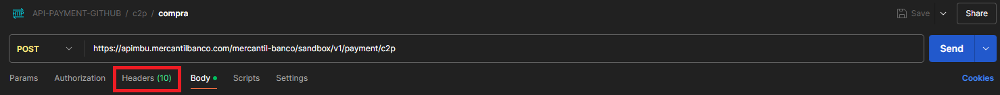
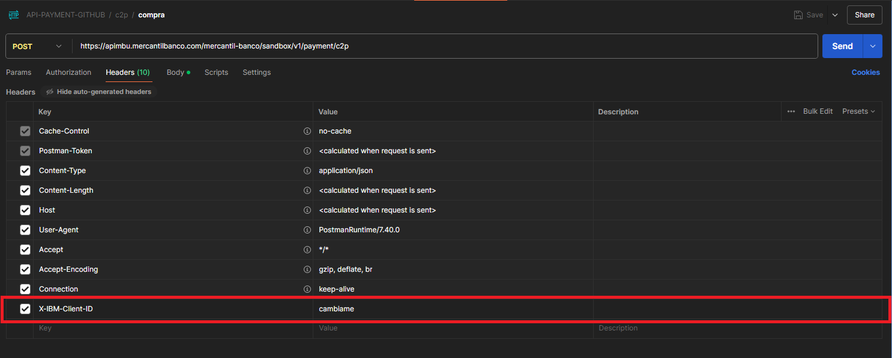

# Colección de Postman para consumir las APIs de Mercantil Banco.

Esta colección de postman contiene todos los request estructurados para el correcto consumo de las APIs de Mercantil Banco.

### Recursos útiles.
1. **Recuerda cambiar el ClientID en los headers de los requests que vayas a utilizar.** 
1.1  
1.2  
2. **Para los campos cifrados de cada request puedes utilizar los [ejemplos de encriptado](https://github.com/apimercantil/encrypt-examples).**
3. **Si deseas un ejemplo práctico puedes consultar los ejemplos [API Playground](https://github.com/apimercantil/api-playground).**